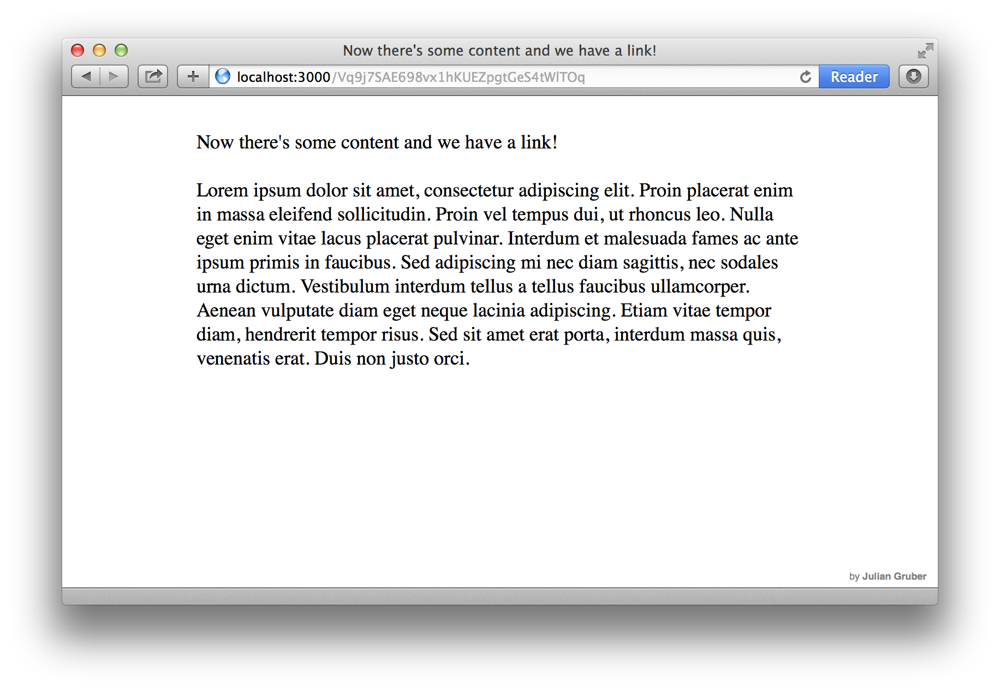

# links

Experimental content sharing and collaboration platform.

* Anonymous
* No UI

## Screenshots




## How it works

You start writing and get a public link. You send that link to someone and they see your content. As soon as they start editing themselves they get their own link which they can share again.

As long as you keep your tab open you can edit without getting a new link.

## Running

You need at least node `0.11.0` to run this.

For production:

```bash
$ sudo npm install -g links
$ cd dir/to/put/the/db/in
$ links
```

For development:

```bash
$ git clone git@github.com:juliangruber/links.git && cd links
$ npm install
$ sudo npm link
$ links
```

## CLI

* `--port, -p` The port to run on
* `--footer` Footer html to display

## TODO

* setup public instance
* add saving indicator
* evaluate storage mechanisms for the token

## Behind the scenes

Using [koa](https://github.com/koajs/koa) for http, [leveldb](https://code.google.com/p/leveldb/) for the database and [component](https://github.com/component/component) for client side javascript.

## License

MIT.
